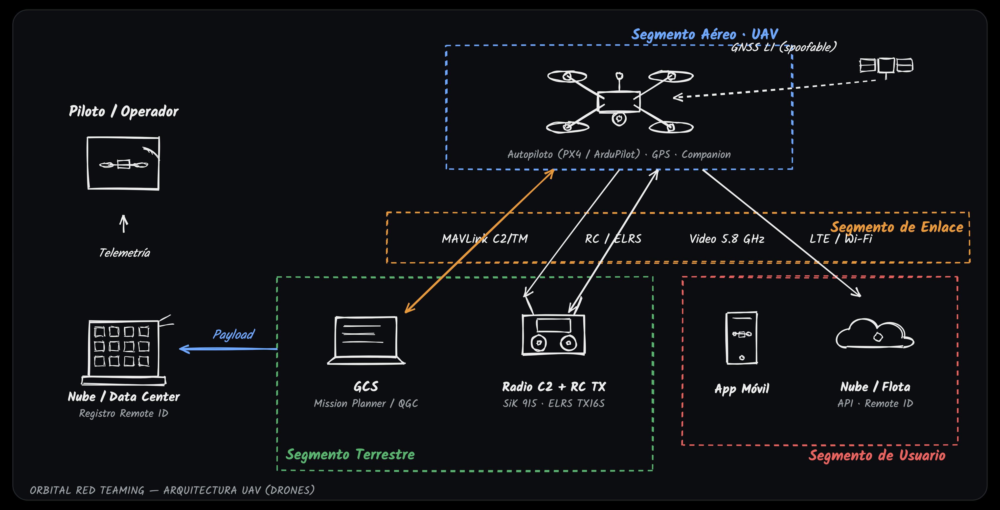

# PWNUAV: a vulnerable-by-design MAVLink drone lab

PWNUAV is a red-team lab and toolkit for **MAVLink-based drones (UAVs)**. It pairs a
vulnerable-by-design drone emulator with five over-the-air attack PoCs, all validated on
real SDR hardware, and it proposes a **TTP taxonomy for drones** — the PWNUAV Matrix.

It is the drone counterpart to **PWNSAT** (a vulnerable FlatSat) and **PWNCube** (a
vulnerable CubeSat). The thesis is simple: **the same offensive red-team methodology
applies to satellites and to drones.** Satellites speak CCSDS/SPP; drones speak MAVLink.
The methodology does not change.



> **Legal & safety notice.** GPS spoofing (1575.42 MHz) and RF jamming are illegal to
> radiate in the open in nearly every country and endanger third parties (aviation,
> navigation, networks). In this project **every transmission happens inside a Faraday
> cage** (or over coax with attenuators), at minimum power. This code is for authorized
> research, training and defensive work only. You are responsible for how you use it.

## The 5-phase methodology:

1. RF recon
2. Protocol reverse engineering 
3. C2 surface analysis (ground/control station, internal buses)
4. Air-gap crossing via SDR
5. Impact assessment

Each phase maps onto stages of the **PWNUAV Matrix** see
[`pwnuav/docs/TAXONOMY.md`](pwnuav/docs/TAXONOMY.md). For satellites there is SPARTA (The
Aerospace Corporation); for drones there is no consolidated equivalent, and closing that
gap is part of the point of this project.

## Repository layout

Two content folders: the **tool** and the **scripts**, plus the test suite.

```
PWNUAV/
├── pwnuav/                 # THE TOOL (framework, importable package)
│   ├── link.py             MAVLink connect/announce helpers
│   ├── drone_stub.py       vulnerable-by-design drone (no SITL needed) + optional failsafe
│   ├── mav_hub.py          UDP MAVLink reflector / fan-out with flood (jamming) detection
│   ├── drone_service.py    long-running drone service
│   ├── recon.py            MAVLink recon (RC/PA)
│   ├── eavesdrop.py        passive telemetry capture (IA-01/IM-04)
│   ├── inject.py           command injection from a spoofed GCS (C2/EX)
│   ├── gps_spoof.py        virtual GPS spoofing via GPS_INPUT (NV-01)
│   ├── jam.py              RF jamming / DoS (IM-01)
│   ├── tui.py, demo.py     shared dashboard / demo helpers
│   ├── rf/                 GFSK modem: framing, gfsk, channel model, receiver,
│   │                       MAVLink-over-RF transport, SoapySDR I/O, hardware roles
│   ├── emulator/           SITL bootstrap, MAVLink↔RF bridge, live console monitor
│   └── docs/               DESIGN.md, TAXONOMY.md, hardware setup
├── attacks/               # THE SCRIPTS (the 5 PoCs + interactive demos)
│   ├── 01-recon/ … 05-jamming/   over-the-air PoC + README + real captured output
│   └── demos/             two-terminal interactive demos (drone + attacker)
├── tests/                 # test suite (software modem, channel model, MAVLink)
├── pyproject.toml
└── README.md
```

## Install

Software lab (no radios required pure software modem + drone stub/SITL):

```bash
git clone https://github.com/r0r0x-xx/PWNUAV.git
cd PWNUAV
python3 -m venv .venv && source .venv/bin/activate
pip install -e ".[dev]"
pytest                     # run the test suite
```

The over-the-air PoCs additionally need SoapySDR with device modules (SoapyHackRF /
SoapyPlutoSDR / SoapyRTLSDR), which are not pip packages. Install the system SDR stack and
create a separate radio venv:
[`pwnuav/emulator/rf-bridge/SETUP-HARDWARE.md`](pwnuav/emulator/rf-bridge/SETUP-HARDWARE.md).

## Quick start (software, no hardware)

Interactive two-terminal demo terminal 1 hosts the drone, terminal 2 runs an attack:

```bash
# terminal 1 — the drone (MAVLink hub + vulnerable stub, live ASCII console)
python attacks/demos/drone.py

# terminal 2 — an attack against it
python attacks/demos/01-recon/recon.py
```

Or drive the drone stub / SITL over UDP with the installed console scripts:

```bash
pwnuav-recon     --connect udpin:127.0.0.1:14550 --duration 3
pwnuav-eavesdrop --connect udpin:127.0.0.1:14550 --duration 3
pwnuav-inject    --connect udpin:127.0.0.1:14550 --mode 4
pwnuav-gps-spoof --connect udpin:127.0.0.1:14550
```

## The 5 PoCs

Four run **over the air** with SDRs inside a Faraday cage; GPS spoofing is **local/virtual**
(GPS_INPUT injection, no GPS hardware). Every PoC folder ships its own README, the attack
script, and the **real captured output** of a validated run.

| # | PoC | PWNUAV stages | Mode | Result (validated on hardware) |
|---|---|---|---|---|
| 01 | MAVLink recon | RC, PA | RF | Drone enumerated (sysid=1, QUADROTOR, ArduPilot) + message inventory |
| 02 | Telemetry eavesdropping | IA-01, PA-01, IM-04 | RF | Full flight picture in the clear (position/GPS/attitude/battery) |
| 03 | Command injection | C2, EX | RF | Valid ARM + SET_GUIDED over the air from a spoofed GCS (sysid 255) |
| 04 | GPS spoofing | NV-01, IM-03 | Local | Position jumped ~5.876 km to fake coordinates |
| 05 | Jamming / DoS | IM-01, IM-02 | RF | Link ~449 → ~42 heartbeats (~90% loss, DoS) |

Run the over-the-air PoCs from the radio venv, inside the cage:

```bash
source .venv-radio/bin/activate
python attacks/01-recon/recon_aire.py
python attacks/02-eavesdrop/eavesdrop_aire.py
python attacks/03-cmd-injection/inject_aire.py
python attacks/05-jamming/jam_aire.py

# GPS spoofing is local (normal venv):
python attacks/04-gps-spoof/gps_spoof_local.py
```

## Validated hardware roles

| Function | Radio |
|---|---|
| Drone / attacker uplink (GFSK TX) | ADALM-Pluto (transmits clean) |
| Eavesdropper / receiver (RX) | RTL-SDR (or Pluto) |
| Jammer (noise TX) | HackRF |

**Key bring-up finding:** the HackRF corrupts our GFSK waveform when transmitting it (it
reproduces a clean tone but not the modulated signal beyond the burst start), which is
exactly why it makes a good jammer; the Pluto transmits clean. Full detail in
[`pwnuav/emulator/rf-bridge/SETUP-HARDWARE.md`](pwnuav/emulator/rf-bridge/SETUP-HARDWARE.md).

## Why it matters

MAVLink is the de-facto C2/telemetry protocol for the civilian drone world, yet it ships
without encryption and with only optional message signing (HMAC-SHA-256) that is rarely
enabled. There is no consolidated, security-first standards body spanning the whole drone
stack, and no consolidated offensive TTP framework equivalent to SPARTA. PWNUAV makes those
gaps concrete and gives defenders and researchers something to practice against.

## Documentation

- [`pwnuav/docs/DESIGN.md`](pwnuav/docs/DESIGN.md): architecture, RF/PoC design, honest
  link-reliability analysis.
- [`pwnuav/docs/TAXONOMY.md`](pwnuav/docs/TAXONOMY.md): the PWNUAV Matrix (7 stages, TTPs).
- [`attacks/README.md`](attacks/README.md): the PoCs, radio configuration, how to run.

## License

MIT: see [`LICENSE`](LICENSE).
